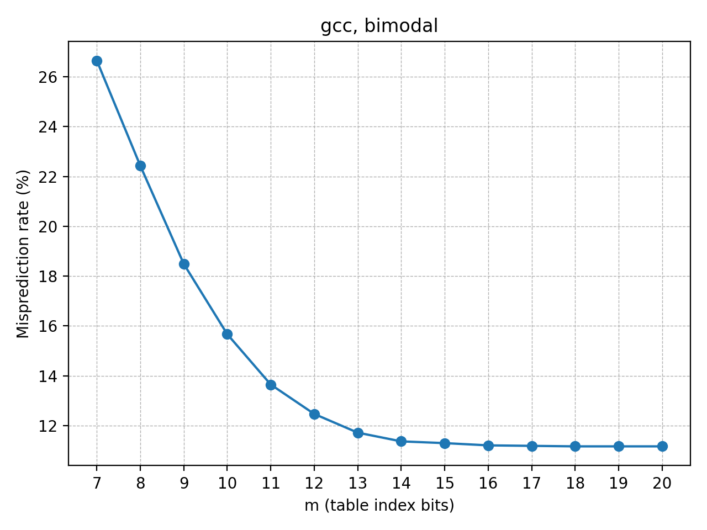
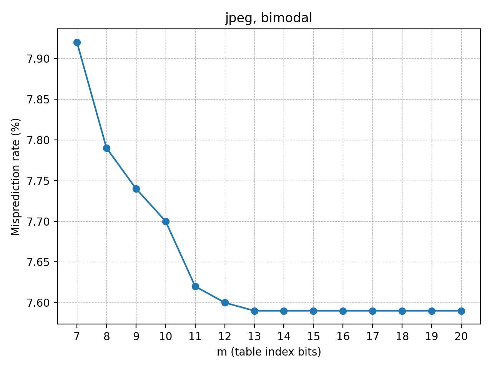
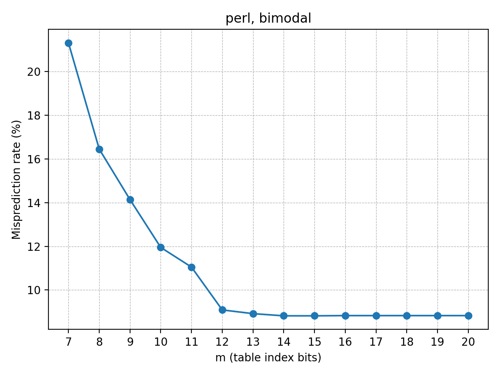
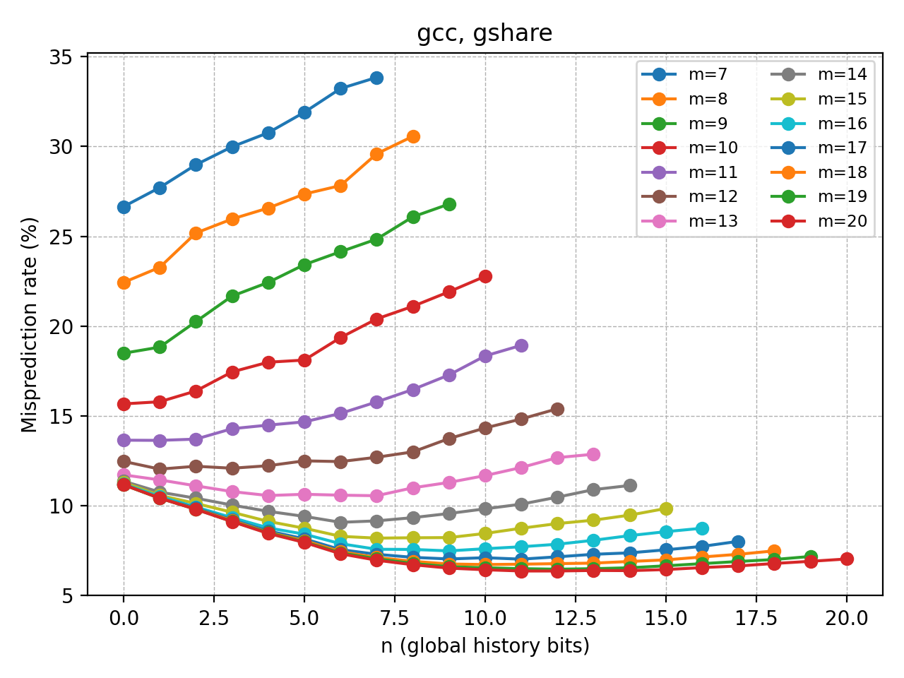

# Branch Predictor Simulator Overview

This document summarizes the structure, behavior, and usage of the Project 2 branch predictor simulator, including testing commands and representative code snippets.

## 1. What the Simulator Does

The `sim` binary models three predictor configurations described in the assignment spec:

| Mode    | Command shape                                      | Description                                                                    |
|---------|----------------------------------------------------|--------------------------------------------------------------------------------|
| bimodal | `./sim bimodal <M2> <trace>`                       | 2-bit counters indexed by `<M2>` low-order PC bits (with the low two bits dropped). |
| gshare  | `./sim gshare <M1> <N> <trace>`                    | Gshare predictor: splits `<M1>` bits, XORs the top `<N>` with the global history register (GHR). |
| hybrid  | `./sim hybrid <K> <M1> <N> <M2> <trace>`          | Chooses between gshare and bimodal using a chooser table of 2-bit counters.                   |

Each run:

1. Reads a trace (`<hex_pc> t|n` per line).
2. Generates a prediction from the chosen structure.
3. Updates the relevant table(s) and (for gshare/hybrid) the GHR.
4. Tracks prediction/misprediction counts.
5. Prints final stats plus the table contents (matching the provided validation formatting).

## 2. Repository Layout

```bash
.
├── graphs            # analysis workspace: CSVs, plots, optional venv
│   ├── figs
│   └── results
├── scripts           # automation helpers (validation + sweeps)
├── traces            # branch traces used by the simulator
├── validation        # expected outputs for the Gradescope runs
├── sim.cc / sim.h    # predictor implementations and CLI handling
├── Makefile          # builds ./sim
├── README.md         # quick-start guide
└── PROJECT_OVERVIEW.md (this document)
```

For the full picture (including archival zips shipped with the starter kit) run:

```bash
tree -L 2
```

## 3. Building and Running

### Build

```bash
make
```

Produces `./sim` at the repository root.

### Example Invocations

```bash
./sim bimodal 6 traces/gcc_trace.txt
./sim gshare 9 3 traces/gcc_trace.txt
./sim hybrid 8 14 10 5 traces/gcc_trace.txt
```

Outputs include the command echo, prediction statistics, and final table dumps exactly as required by the spec. For instance:

```
COMMAND
 ./sim gshare 9 3 traces/gcc_trace.txt
OUTPUT
 number of predictions:    2000000
 number of mispredictions: 433345
 misprediction rate:       21.67%
FINAL GSHARE CONTENTS
 0	3
 1	3
 ...
```

## 4. Testing and Validation

### Gradescope Validation Suite

Run the entire official suite (all bimodal/gshare/hybrid validations) with:

```bash
scripts/validate.sh
```

This script executes each reference command, diff-checks the output with `diff -iw`, and prints a summary:

```
PASS val_bimodal_1.txt
...
Summary: 10 passed, 0 failed.
```

### Parameter Sweeps and Plots

Set up a Python environment (optional but recommended for Matplotlib):

```bash
python -m venv graphs/.venv
source graphs/.venv/bin/activate
pip install matplotlib
```

Run sweeps and generate CSVs + plots:

```bash
python scripts/sweep.py
```

* CSVs land in `graphs/results/`
* Figures (PNG) land in `graphs/figs/`

Use flags like `--no-plots`, `--bimodal`, `--gshare`, or `--hybrid` to tailor runs. A JSON file can provide custom hybrid combos (see `README.md`).

## 5. Code Highlights

### Bimodal Predictor (excerpt from `sim.cc`:91)

```cpp
std::size_t BimodalPredictor::index(std::uint64_t pc) const {
    if (m_bits_ == 0) {
        return 0;
    }
    return static_cast<std::size_t>((pc >> 2) & mask_);
}

TableLookup BimodalPredictor::predict(std::uint64_t pc) const {
    std::size_t idx = index(pc);
    bool pred = counters_[idx] >= 2;
    return {pred, idx};
}
```

The index drops the low two bits of the PC; counters hold 2-bit saturating values initialised to “weakly taken”.

### Gshare Predictor (excerpt from `sim.cc`:134)

```cpp
std::size_t GsharePredictor::index(std::uint64_t pc) const {
    if (m_bits_ == 0) {
        return 0;
    }

    std::size_t pc_index = static_cast<std::size_t>((pc >> 2) & table_mask_);
    if (n_bits_ == 0) {
        return pc_index;
    }

    std::size_t ghr_masked = static_cast<std::size_t>(ghr_ & history_mask_);
    std::size_t upper_bits = pc_index >> (m_bits_ - n_bits_);
    std::size_t xored = upper_bits ^ ghr_masked;
    return (xored << (m_bits_ - n_bits_)) | (pc_index & lower_mask_);
}
```

The GHR is shifted right each cycle with the newest outcome fed into the MSB (`sim.cc`:118). The XOR only applies to the top `<N>` bits of the PC index.

### Hybrid Predictor (excerpt from `sim.cc`:165)

```cpp
HybridPredictor::HybridInfo HybridPredictor::predict(std::uint64_t pc) {
    HybridInfo info;
    info.gshare_info = gshare_.predict(pc);
    info.bimodal_info = bimodal_.predict(pc);
    info.chooser_index = chooser_index(pc);
    info.use_gshare = chooser_counters_[info.chooser_index] >= 2;
    info.overall_prediction = info.use_gshare
        ? info.gshare_info.predicted_taken
        : info.bimodal_info.predicted_taken;
    return info;
}

void HybridPredictor::update(const HybridInfo &info, bool taken) {
    bool gshare_correct = (info.gshare_info.predicted_taken == taken);
    bool bimodal_correct = (info.bimodal_info.predicted_taken == taken);

    if (info.use_gshare) {
        gshare_.update(info.gshare_info, taken, true);
    } else {
        bimodal_.update(info.bimodal_info, taken);
        gshare_.update(info.gshare_info, taken, false);  // still roll GHR
    }

    if (gshare_correct && !bimodal_correct) {
        increment_chooser(info.chooser_index);
    } else if (bimodal_correct && !gshare_correct) {
        decrement_chooser(info.chooser_index);
    }
}
```

The chooser table saturates between 0 and 3, biasing towards gshare at initialisation (`INIT_CHOOSER = 1`). The gshare history updates every cycle even when bimodal makes the prediction.

## 6. Expected Outputs

Validation output files under `validation/expected/` are authoritative. After running:

```bash
./sim hybrid 8 14 10 5 traces/gcc_trace.txt > my_output.txt
diff -iw my_output.txt validation/expected/val_hybrid_1.txt
```

`diff` should report no differences. The formatting (blank lines, ordering) must mirror the reference exactly; `diff -iw` only relaxes case and intra-line whitespace.

## 7. Next Steps

* Populate `report.pdf` based on the official template using the data in `graphs/results/`.
* (Optional) Extend `scripts/sweep.py` with additional hybrid grids or templated experiment batches.
* Keep running `scripts/validate.sh` after code changes to ensure spec-aligned formatting and behavior.

## 8. Report Figures (What to Expect)

Running `python scripts/sweep.py` generates the required PNGs under `graphs/figs/`. The table below maps each file to the slot in the Word template and highlights the trends you should see:

| File | Template slot | What it shows |
|------|---------------|---------------|
| `graphs/figs/gcc_bimodal.png` | “gcc, bimodal” | A single line with 14 markers (`m = 7..20`). The rate drops quickly then flattens when the table is big enough—use it to answer the “bottoms-out” question. |
| `graphs/figs/jpeg_bimodal.png` | “jpeg, bimodal” | Same axes as gcc. Expect a steeper early drop and earlier plateau, indicative of fewer unique static branches. |
| `graphs/figs/perl_bimodal.png` | “perl, bimodal” | Captures the Perl trace; generally smoother with a moderate plateau. |
| `graphs/figs/gcc_gshare.png` | “gcc, gshare” | 14 curves (one per `m = 7..20`). Each curve plots `n = 0..m`, helping identify the best history length per table size. This feeds Part 2 analysis questions directly. |
| `graphs/figs/hybrid_overview.png` | Optional figure for Part 3 commentary | A scatter of representative hybrid configurations. Use it to argue why certain chooser/gshare/bimodal mixes perform best. |

Each plot uses misprediction rate (%) on the Y-axis. If you resize them in the report, double-check that axis labels remain legible. The underlying numbers live in `graphs/results/*.csv`, which are handy for filling in tables (e.g., minimum misprediction rates).










For quick inquiries or troubleshooting, scan `README.md` for command summaries and the spec (`proj2-v1.0.pdf`) for rule clarifications.
