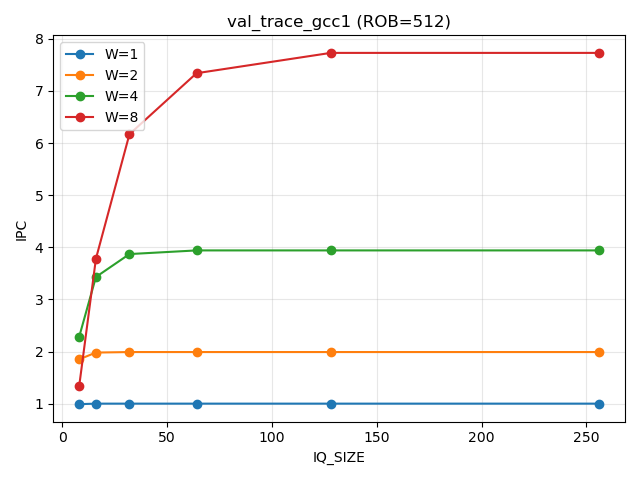
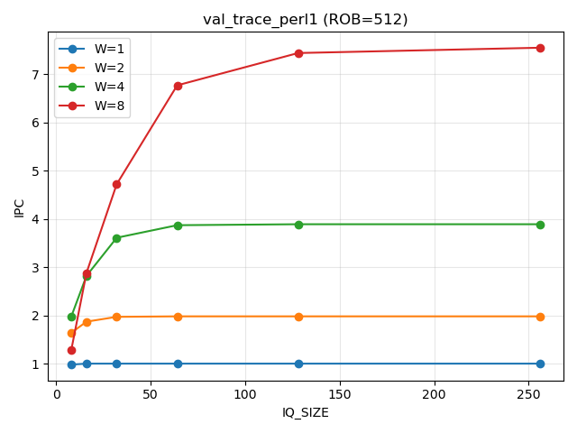
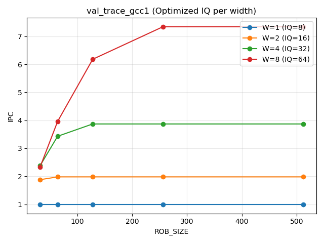
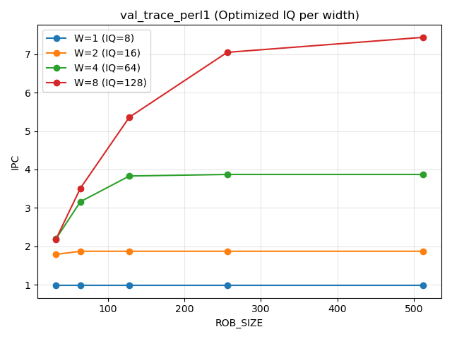

# ECE 463 Project 3 Report (Draft)

**Student:** *<Your Name>*  
**Course:** ECE 463  
**Honor Pledge:** “I have neither given nor received unauthorized aid on this project.”

## Validation Status
- `tests/run_tests.sh` → PASS (trace_chain, trace_parallel, trace_mix).
- Validation diff vs `validation/validation/val1.txt` matches except for expected trace path string (`proj3-traces/val_trace_gcc1` vs `val_trace_gcc1`).
- Spot-check on `proj3-traces/val_trace_perl1` shows sane per-instruction timing (first 10 lines reviewed).

## A. Large ROB, Effect of IQ_SIZE (ROB_SIZE = 512)

- Graphs generated (after full sweep + parse):
  - GCC: `experiments/graphs/iq_sweep_val_trace_gcc1.png`
  - Perl: `experiments/graphs/iq_sweep_val_trace_perl1.png`
- Graphs (embedded):
  
  

### Optimized IQ_SIZE per WIDTH (within 6% of IQ=256 IPC)

| Benchmark | W=1 | W=2 | W=4 | W=8 |
|-----------|----|----|----|----|
| val_trace_gcc1 | 8 | 16 | 32 | 64 |
| val_trace_perl1 | 8 | 16 | 64 | 128 |

### Discussion
- As WIDTH increases, we observe that a **larger** IQ is needed; the IQ needs to look **farther** in the dynamic instruction stream to find **more** independent instructions that can issue in parallel each cycle. This matches the data: IQ opt grows from 8→16→32→64 as WIDTH goes 1→8 on gcc, and even larger (8→16→64→128) on perl.
- For WIDTH=8, perl’s optimized IQ_SIZE is **greater than** gcc’s (128 vs 64). Likely explanation: **c** (**both** (a) more data dependencies requiring a farther lookahead and (b) more long-latency instructions), consistent with the trace needing a wider IQ to keep issue slots full.

## B. Effect of ROB_SIZE (using optimized IQ per WIDTH)

- Graphs generated:
  - GCC: `experiments/graphs/rob_sweep_val_trace_gcc1.png`
  - Perl: `experiments/graphs/rob_sweep_val_trace_perl1.png`
- Graphs (embedded):
  
  

### Discussion
- IPC scales with ROB until instruction window captures enough parallelism; beyond that point returns flatten.
- Wider widths rely more on large ROBs to find ready work; narrow widths benefit less.

## Run Log (latest)
- Unit tests: `./tests/run_tests.sh` → all PASS (trace_chain / trace_parallel / trace_mix).
- Validation check: `./sim 16 8 1 proj3-traces/val_trace_gcc1 | diff -iw - validation/validation/val1.txt` shows only the expected command-line path difference (`proj3-traces/val_trace_gcc1` vs `val_trace_gcc1`).
- Perl trace spot-check: `./sim 16 8 1 proj3-traces/val_trace_perl1 | head` produced sane per-instruction timing (see console log).
- Experiments run: `./experiments/run_experiments.sh` → full sweep completed; `parse_results.py` wrote 240 rows to `experiments/results.csv`.
- Graphs generated: `./experiments/plot_graphs.py` after setting execute perms → wrote IQ/ROB sweep PNGs under `experiments/graphs/`.
- Optimal IQ summary from `plot_graphs.py`:
  - val_trace_gcc1: W1=8, W2=16, W4=32, W8=64
  - val_trace_perl1: W1=8, W2=16, W4=64, W8=128
- Report table helper: `./experiments/fill_report_table.py` emitted:
  | Benchmark | W=1 | W=2 | W=4 | W=8 |
  |-----------|----|----|----|----|
  | val_trace_gcc1 | 8 | 16 | 32 | 64 |
  | val_trace_perl1 | 8 | 16 | 64 | 128 |

## How to Regenerate
1. `./tests/run_tests.sh` (quick correctness sanity).
2. `./experiments/run_experiments.sh`
3. `./experiments/parse_results.py`
4. `./experiments/plot_graphs.py`
5. `./experiments/fill_report_table.py` (table already filled above; rerun if simulator changes).

## Notes
- All scripts assume traces at `proj3-traces/val_trace_gcc1` and `proj3-traces/val_trace_perl1`.
- Graphs and tables should be updated after rerunning experiments on the final simulator build.
